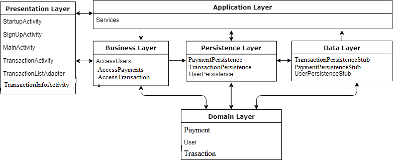

## Presentation Layer

**StartUpActivity**

The Activity which launched on startup. It allows the users to login into their accounts or go to sign up page

**SignUpActivity**

This activity lets the users to create a new account. Once the sign up is successful the users are sent to the startup page again for login

**MainActivity**

Home page for the user once they have logged in. Shows a list of their respective transactions

**TransactionActivity**

Activity which lets users add new transactions to their transactions list

**TransactionListAdapter**

Responsible for showing User transactions as a list at home page

## Business Layer

**AccessUsers**

Accessor class for users and appropriate methods through persistence

**AccessPayments**

Accessor class for user transactions and appropriate methods through persistence

## Persistence Layer

**UserPersistence**

Responsible for communication between the business layer and Data layer for User data

**PaymentPersistence**

Responsible for communication between the business layer and Data layer for User transactions data

## Domain Layer

**User**

User Object

**Payment**

Payment Object

## Application Layer

**Services**

Responsible for maintaining consistency and synchronization multiple layers

## Data Layer

**UserPersistenceStub**

Stub data of users

**UserPersistenceStub**

Stub data of user transactions

